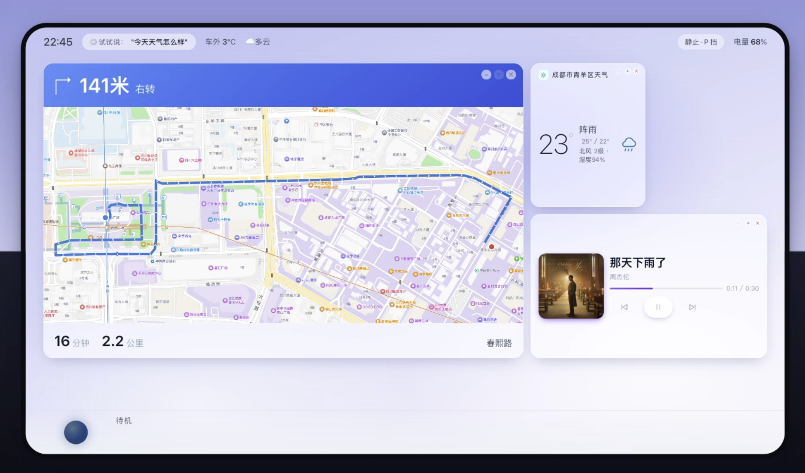
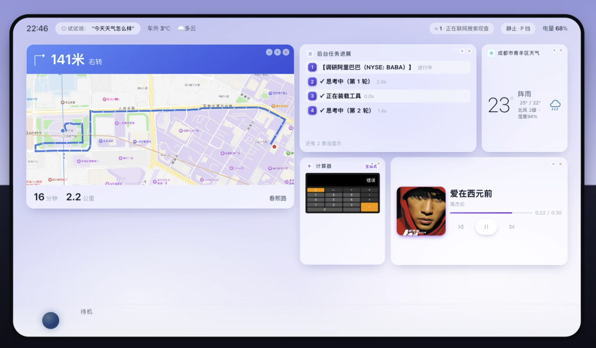
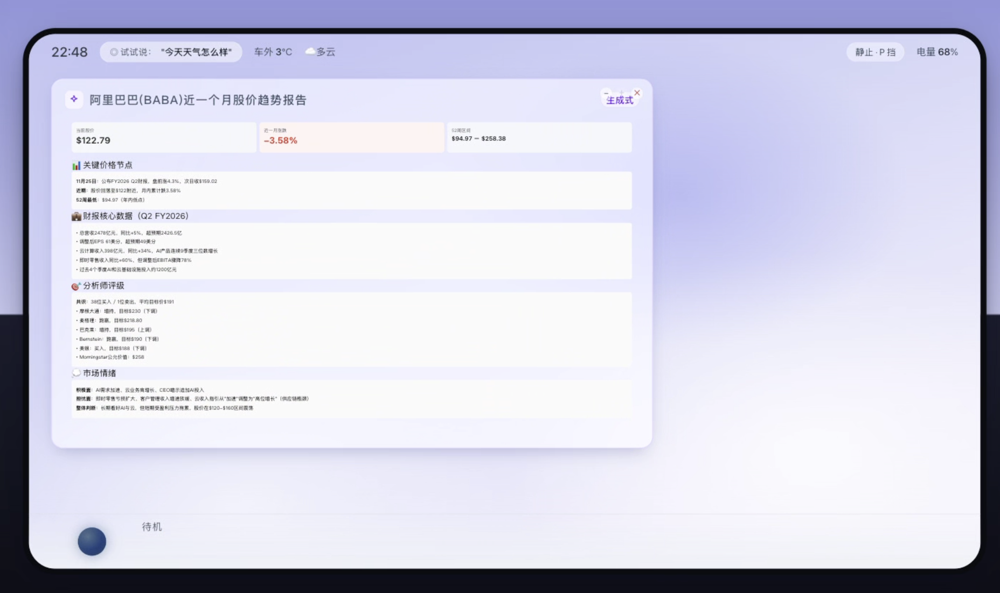
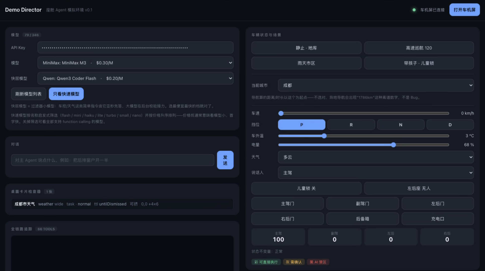
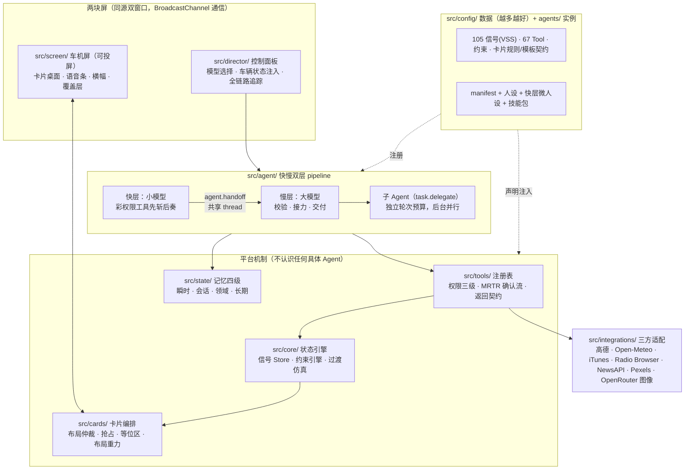

# cockpit-agent-sim

一个面向智能座舱业务的 Agent 框架。零后端、零运行时依赖。
An agent framework for smart-cockpit applications. Zero backend, zero runtime deps.

这个项目最早是给座舱产品经理搭 AI Demo 用的。做着做着发现，不管是搭演示、验证架构，还是探索座舱里"无 APP 化"的交互，底下要的机制其实是同一套：信号怎么管、工具怎么分级授权、危险操作怎么确认、卡片怎么上屏、快慢两个模型怎么配合。既然如此，索性把机制层做扎实（现在有 1177 个测试盯着），把业务留成数据——你要接自己的东西，往 `src/config/` 里加就行，一条信号、一个 Tool、一条卡片规则，平台代码一行不用动。

对话是真实 LLM 驱动的，导航、天气、音乐、新闻、云端 TTS 接的都是真实服务。车机屏是独立窗口，拖到外接屏按 F 全屏，直接就能拿去演示。



| 后台子 Agent 调研 + 生成式计算器卡 | 调研交付：生成式报告卡（canvas） |
|---|---|
|  |  |



## 快速开始

```bash
npm install
cp .env.local.example .env.local   # 填入你自己的 Key（见文件内注释）
npm run dev                        # → http://localhost:5173
```

装完打开控制面板，选好模型（慢层一个、快层一个），点「打开车机屏」，就可以说话或打字了。不知道说什么的话，从这几句开始：「今天天气怎么样」「导航去春熙路」「放首歌」「给我做个计算器」「给孩子讲个故事」。

Key 的门槛很低：一个 [OpenRouter](https://openrouter.ai) 的 Key 就能对话和车控。导航和地图要高德的 Key；天气、音乐、电台用的都是免注册服务，什么都不用配。

```bash
npm test               # 1177 个测试，全绿才算完成
npx tsc --noEmit       # 类型检查
npm run pilot [场景id] # 自动化体验闭环（消耗真实 API 额度，不进 npm test）
node build-single.mjs  # 单文件版 → single/（双击可开；注意读不到 .env，Key 相关能力不可用）
```

## 系统架构

整个设计被四条硬约束框着，违反哪条都算设计失败：

- **零后端产物。** 构建出来就是一堆静态文件。开发服务器带一个纯转发代理来绕开 CORS，但代理里不许写业务逻辑。
- **加能力 = 加数据。** 新增信号、约束、Tool 都只动 `src/config/`。哪天发现要改 `src/core/` 才能加功能，说明抽象错了。
- **代码里不许出现意图分支。** 出现 `if (intent === ...)` 或者关键词匹配就算违规。模型表现不好，改 Prompt 或改工具描述，不在代码里兜底——兜了就分不清是模型聪明还是代码作弊。
- **运行时依赖为零。** 只有 vite、vitest、typescript 三个 devDependency。加新依赖前先问一句：不加它要多写多少行？少于两百行就自己写。



### Agent 的组成部分

**快慢双层。** 一句话进来先到快层——一个便宜的小模型，手上只有十几个可以放心直接执行的工具（开窗、调温、查天气这类），能办的立刻办、立刻回话。但无论办没办成，它都要把这一轮转交给慢层：两层共享同一份对话记录，慢层对着快层的调用记录做校验，错了就改，剩下的活接着干；要是一切都对、也没什么可补充的，它就闭嘴——沉默在这里是合法且常见的答案。快层碰到自己无权调的工具会立刻收手转交，被拒的工具名直接预载给慢层，一轮都不浪费。

**工具按粒度装载，没有"域"的概念。** 慢层常驻的只有一份工具目录（每个工具一行简介）和几个高频管道（语音、卡片、记忆），要用什么就调 `tools.load` 点名取。转交、装载、取技能、派任务这几个元工具由 pipeline 注入，不占业务工具表。

**耗时的重活派给子 Agent。** 联网查证、写调研报告这类活走 `task.delegate`：怎么拆归慢层模型决定，一轮连发几个就是并行；后台模式立即返回，完成后自动交付（卡片、播报、横幅），不叫醒主模型。子 Agent 有边界：深度只有一层，并发最多三个，没有危险权限，也不能出声。

**Skill 管章法。** 工具是能力，技能是章法，人设是品格，记忆是事实——四样东西各归各的地方，不许混。技能包放在 `agents/main-agent/skills/`（导航、媒体、调研报告、儿童绘本），平时只有目录行在场，用到了再取正文照章执行。

**用户随时可以插话。** 每轮对话带世代戳。用户追加一句，旧的那轮活照干完、只是不再抢麦，迟到的话术降级进横幅；用户清空会话，那就连副作用一起作废。这两种"作废"的处置正好相反，不区分的话会出现重置之后幽灵对话复活这种事——我们踩过。

**记忆分四级。** 瞬时是信号 Store（对齐 VSS）；会话是域仓结论加对话滑窗摘要，由小模型异步压缩；领域是播放队列、历史、收藏，落 localStorage；长期是用户明说要记的偏好，注入 system，最多十条。偏好的自动学习明确不做：用户明说的记下来是数据，"他连调三次 24 度就记住"是策略，策略不进代码。

**权限分黑灰彩三级。** 彩直接执行；灰要二次确认，判据是不可逆、涉安全、涉钱、涉他人；黑永不注册给 Agent——刹车、转向这类工具压根不存在，而不是存在但被拒，这两件事必须分清。

### 卡片编排（模型零参与的那一半）

桌面不归模型管。桌面等于车辆状态的函数：导航卡、车控回执这些基础内容由声明式规则驱动，编排器负责调和，模型全程零参与；模型只为规则覆盖不到的临场内容建卡（候选列表、生成式小组件），而且走同一套布局仲裁，不开后门。栅格 12×8，十四种形状，每种形状只有一种几何——这里不追求空间利用率最优，追求演示的人能预判结果。放不下的卡进等位区排队，有空位自动上台，不会凭空消失；布局重力让卡片只往左上流动，结果是确定的。显示分三条通道：卡片放内容，横幅放解释（拒绝原因、执行回执——这些是对动作的说明，不是内容本身），覆盖层留给危急告警。另有一张 `canvas` 模板允许模型直接产出 HTML/SVG 进 Shadow DOM 沙箱渲染，这确实牺牲了可预测性，所以前面立了六道闸：消毒白名单、像素容量契约、升档、缩放、滚动、文字兜底。

### 工程纪律

开发全程 TDD：先写测试看它红，再写实现看它绿，1177 个测试全绿才算完成。每个目录有行数预算，超了不是上调预算，是先查有没有业务逻辑漏进了不该在的层。Tool 是机制，Agent 是策略——`climate.set` 绝不因为外面冷就自作主张多加两度。命名不自己发明：信号对齐 COVESA VSS v6.0，元数据对齐 AAOS，确认流对齐 MCP 的 MRTR。

另外有一套叫 pilot 的自动化体验闭环：用一个独立的 LLM 扮演坐在车里的真人，跟真实 Agent 跑多轮对话，过程落盘成快照，人按四个维度评审。很多真问题——几何死局导致导航卡出不来、思维链泄漏进播报、模型把六轮全烧在调工具上一句话没说——都是它抓出来的。

更细的东西都在 docs 里：[需求规格说明书](docs/需求规格说明书_v1.0.md) 讲要做什么，[工程约束](docs/工程约束_v1.1.md) 讲底线，[superpowers/specs/](docs/superpowers/specs/) 是每一轮的设计文档。

## 能力清单（67 Tools）

下面是全部工具，按域分组。权限一栏：彩是直接执行，灰要二次确认，黑永不注册给 Agent；带 ⚡ 的挂在快层，小模型可以先斩后奏。整张清单声明在 `src/config/tools.ts` 里，加工具就是往里加一段数据。

<details>
<summary><b>车控与车辆状态</b>（18 个）</summary>

| Tool | 说明 | 权限 | 快层 |
|---|---|:-:|:-:|
| `vehicle.getState` | 读车辆当前状态 | 彩 | ⚡ |
| `capability.list` | 屏上显示能力目录 | 彩 |  |
| `window.set` | 控制车窗开度 | 彩 | ⚡ |
| `climate.set` | 空调温度风量出风 | 彩 | ⚡ |
| `seat.set` | 座椅加热通风调节 | 彩 | ⚡ |
| `steeringWheel.set` | 方向盘加热 | 彩 | ⚡ |
| `sunroof.set` | 天窗开合 | 彩 | ⚡ |
| `mirror.set` | 后视镜折叠与加热 | 彩 | ⚡ |
| `airPurifier.set` | 空气净化器开关档位 | 彩 | ⚡ |
| `wiper.set` | 雨刷挡位 | 彩 | ⚡ |
| `door.set` | 开关车门，需确认 | 灰 |  |
| `trunk.set` | 开关后备箱，需确认 | 灰 |  |
| `chargePort.set` | 开关充电口，需确认 | 彩 |  |
| `childLock.set` | 儿童锁开关 | 彩 | ⚡ |
| `ambientLight.set` | 氛围灯开关颜色亮度 | 彩 | ⚡ |
| `fragrance.set` | 香氛开关香型浓度 | 彩 | ⚡ |
| `light.set` | 大灯与后备箱灯 | 彩 | ⚡ |
| `driveSetting.set` | 驾驶模式回收悬架 | 彩 | ⚡ |

</details>

<details>
<summary><b>导航 · 地图 · 天气（高德 + Open-Meteo）</b>（12 个）</summary>

| Tool | 说明 | 权限 | 快层 |
|---|---|:-:|:-:|
| `navigation.search` | 搜地点出候选列表 | 彩 |  |
| `navigation.setDestination` | 设目的地开始导航 | 彩 |  |
| `navigation.searchAlong` | 沿途周边搜服务点 | 彩 |  |
| `navigation.compareRoutes` | 多路线方案对比 | 彩 |  |
| `navigation.control` | 暂停恢复结束导航 | 彩 |  |
| `navigation.getStatus` | 读导航当前状态 | 彩 |  |
| `map.control` | 地图缩放/全览/2D3D/朝向 | 彩 |  |
| `region.districts` | 查周边区县列表 | 彩 |  |
| `places.save` | 存常用地址 | 彩 |  |
| `places.list` | 列常用地址 | 彩 |  |
| `places.remove` | 删一条常用地址 | 彩 |  |
| `weather.query` | 查城市天气预报 | 彩 | ⚡ |

</details>

<details>
<summary><b>媒体（传输控制共用，内容源各自）</b>（17 个）</summary>

| Tool | 说明 | 权限 | 快层 |
|---|---|:-:|:-:|
| `media.control` | 播放暂停上下曲 | 彩 | ⚡ |
| `media.volume` | 调音量 | 彩 | ⚡ |
| `media.seek` | 跳播放进度 | 彩 |  |
| `media.mode` | 循环随机播放模式 | 彩 | ⚡ |
| `media.queue` | 看播放队列 | 彩 |  |
| `media.favorite` | 收藏当前曲目 | 彩 |  |
| `media.favorites` | 列收藏列表 | 彩 |  |
| `music.search` | 搜歌不播 | 彩 |  |
| `music.play` | 搜歌并播放入队 | 彩 | ⚡ |
| `radio.search` | 搜网络电台 | 彩 |  |
| `radio.play` | 搜台并播放 | 彩 | ⚡ |
| `news.headlines` | 今日头条新闻 | 彩 | ⚡ |
| `news.search` | 按话题搜新闻 | 彩 | ⚡ |
| `news.read` | 念一条新闻正文 | 彩 |  |
| `video.search` | 搜短视频 | 彩 |  |
| `video.play` | 搜视频并播放 | 彩 | ⚡ |
| `web.search` | 联网搜索现查 | 彩 |  |

</details>

<details>
<summary><b>语音与屏幕</b>（9 个）</summary>

| Tool | 说明 | 权限 | 快层 |
|---|---|:-:|:-:|
| `voice.speak` | 主动播报一句话 | 彩 |  |
| `voice.ask` | 向用户提问出选择卡 | 彩 |  |
| `voice.config` | 换朗读音色、调语速 | 彩 |  |
| `card.show` | 建卡片上屏 | 彩 |  |
| `card.update` | 更新卡片数据 | 彩 |  |
| `card.resize` | 调卡片大小 | 彩 |  |
| `card.dismiss` | 撤掉卡片 | 彩 |  |
| `card.focus` | 高亮提示一张卡 | 彩 |  |
| `desktop.getLayout` | 读桌面布局 | 彩 |  |

</details>

<details>
<summary><b>记忆</b>（3 个）</summary>

| Tool | 说明 | 权限 | 快层 |
|---|---|:-:|:-:|
| `memory.remember` | 记住用户偏好 | 彩 |  |
| `memory.forget` | 删掉记住的偏好 | 彩 |  |
| `memory.list` | 列出记住的事 | 彩 |  |

</details>

<details>
<summary><b>AI 儿童绘本「路上的故事」</b>（7 个）</summary>

| Tool | 说明 | 权限 | 快层 |
|---|---|:-:|:-:|
| `story.profile` | 记下孩子的名字年龄和这次想讲明白的道理 | 彩 |  |
| `story.cast` | 把孩子的照片画成故事主角 | 彩 |  |
| `story.begin` | 开一本新绘本，讲第一章 | 彩 |  |
| `story.continue` | 接着孩子说的往下写一章 | 彩 |  |
| `story.finish` | 收尾成书 | 彩 |  |
| `story.export` | 把这本书做成可以发给别人的网页 | 彩 |  |
| `story.page` | 翻页/暂停（屏幕按钮直调，不叫醒模型） | 彩 |  |

</details>

<details>
<summary><b>安全边界</b>（1 个）</summary>

| Tool | 说明 | 权限 | 快层 |
|---|---|:-:|:-:|
| `brake.apply` | 黑名单占位：刹车这类工具**永不注册给 Agent**，留在配置里只为标出禁区 | 黑 |  |

</details>

## Key 与第三方服务

| 服务 | 用途 | Key | 条款须知 |
|---|---|---|---|
| OpenRouter | 对话 + 绘本插图 | 必填 | 图像 $0.07/张左右,面板有花费显示 |
| 高德开放平台 | 导航、地名解析、活地图 | 可选,两个 Key | 控制台需把 `localhost` 加入域名白名单 |
| Open-Meteo | 天气(逐时/多日) | **零 Key** | 数据 CC BY 4.0,对外材料请注明 *weather data by [Open-Meteo](https://open-meteo.com)* |
| iTunes Search | 音乐(30 秒试听) | 零 Key | 仅试听片段,无完整播放 |
| Radio Browser | 网络电台 | 零 Key | 社区节点,可用性有波动 |
| NewsAPI | 新闻 | 可选 | ⚠ 免费层**仅限 localhost,禁止部署** |
| Pexels | 短视频 | 可选 | — |
| 讯飞开放平台 | 云端超拟人 TTS(可选,不配则用浏览器本机音色) | 可选,三个值 | 免费额度以控制台为准 |

所有 Key 都放在本地的 `.env.local`（已 gitignore）里，或者直接在控制面板填。没有后端，Key 不会经过任何中间服务器。

## 隐私须知（绘本功能）

「路上的故事」这个功能会把儿童照片发给第三方图像模型（OpenRouter）生成动漫形象。项目本身不存任何照片——没有后端，`public/hero/` 也整个在 gitignore 里——但照片终究要发给模型。所以拿去演示或部署给别人用之前，请确认监护人知情同意；界面里那个授权勾选是一次性的明确动作，不是设置里的默认开关。

## 明确不做

后端、数据库、多屏、日夜切换、CAN 报文级仿真、偏好自动学习。这些不是"还没做"，是想清楚了不做——完整清单和理由见 [docs/工程约束_v1.1.md](docs/工程约束_v1.1.md)。

## License

[MIT](LICENSE)。接的第三方服务各有各的条款，见上面那张表。
