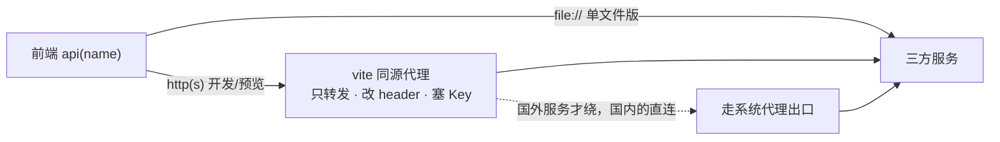
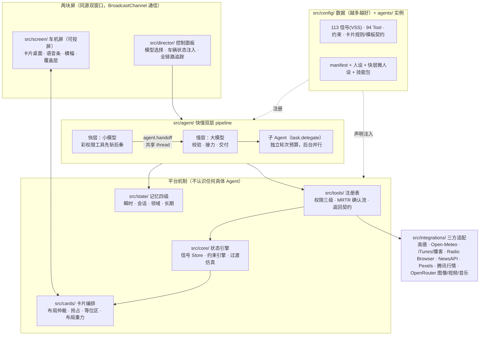
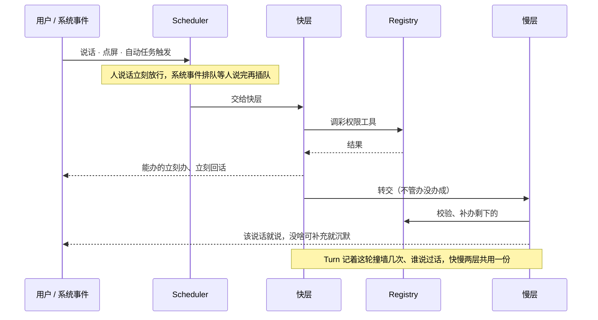
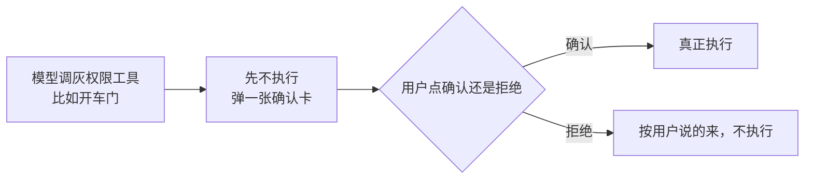
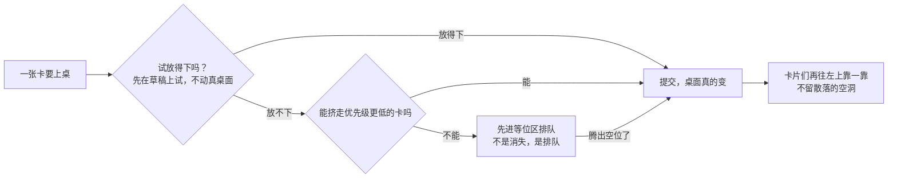

# cockpit-agent-sim

一个面向智能座舱业务的 Agent 框架。覆盖车辆信号模拟、Agent 运行时、记忆系统、工具系统、AI HMI、TTS 等模块，理想情况下对于新增的场景只需要新增 Skill 即可。个人使用需要配置 API，详情见文档。

对话由 LLM 驱动，导航、天气、音乐、新闻、云端 TTS 接的都是真实服务。车机屏是独立窗口，可以用来演示


| 后台子 Agent 调研 + 生成式计算器卡 | 调研交付：生成式报告卡（canvas） |
|---|---|
|  |  |


## 快速开始

```bash
npm install
cp .env.local.example .env.local   # 填入你自己的 Key（见文件内注释）
npm run dev                        # → http://localhost:5173
```
没有做 ASR，直接在控制面板里输入文字即可

Key 的门槛很低：一个 [OpenRouter](https://openrouter.ai) 的 Key 就能启动。导航和地图要高德的 Key；天气、音乐、电台用的都是免注册服务，什么都不用配。

```bash
npm test               # 批量测试
npx tsc --noEmit       # 类型检查
npm run pilot [场景id] # 自动化体验闭环（消耗真实 API 额度，不进 npm test）
node build-single.mjs  # 单文件版 → single/（双击可开；注意读不到 .env，Key 相关能力不可用）
```

## 系统架构

设计约束：

- **零后端。** 只有开发服务器带一个纯转发代理来绕开 CORS，但代理里不写业务逻辑。
- **配置化** 新增信号、约束、Tool 都只动 `src/config/`。
- **代码里不许出现意图分支。** 模型表现不好，只改 Prompt 或改工具描述，不在代码里兜底。
- **运行时依赖为零。** 只有 vite、vitest、typescript 三个 devDependency。

"纯转发代理"：





### Agent 的组成部分

**快慢双层。** 简单任务快层执行，复杂任务慢层执行。（快层目前**默认关闭**、全走慢层——实测可用的小模型要么比大模型还慢、要么爱把工具调用念出来；机制全保留，面板一键可开，换到真正快的模型即可启用。）快层会把执行结果转交给慢层：两层共享同一份对话记录，慢层对着快层的调用记录做校验，错了就改，剩下的活接着干；否则保持沉默。快层碰到自己无权调的工具会立刻收手转交，被拒的工具名直接预载给慢层。



**工具按粒度装载，没有"域"的概念。** 慢层常驻的只有一份工具目录（每个工具一行简介）和几个高频管道（语音、卡片、记忆），要用什么就调 `tools.load` 获取。转交、装载、取技能、派任务这几个元工具由 pipeline 注入，不占业务工具表。

**耗时的重活派给子 Agent。** 联网查证、写调研报告这类活走 `task.delegate`：怎么拆归慢层模型决定，一轮连发几个就是并行；后台模式立即返回，完成后自动交付（卡片、播报、横幅），不叫醒主模型。子 Agent 有边界：深度只有一层，并发最多三个，没有危险权限，也不能出声。

**Skill** 工具是能力，技能是章法，人设是品格，记忆是事实——四样东西各归各的地方，不许混。技能包放在 `agents/main-agent/skills/`（导航、媒体、调研报告、儿童绘本），平时只有目录行在场，用到了再取正文执行。

**用户随时可以插话。** 每轮对话带标签。用户追加一句，旧的那轮活照干完、只是不再抢占，迟到的话术降级进横幅；清空会话则整轮直接作废。

**记忆分四级。** 瞬时是信号 Store（对齐 VSS）；会话是域仓结论加对话滑窗摘要，由小模型异步压缩；领域是播放队列、历史、收藏，落 localStorage；长期是用户明说要记的偏好，注入 system，最多十条。偏好的自动学习不做。
长对话（几十轮的功能巡演）另有三道保线：压缩**滞后批量化**（攒够十轮才折叠一次，摘要不被反复复印丢细节）；**议程位** `agenda.set`——模型给自己记一条跨轮主线备忘，每轮随状态注入回到眼前、不经过压缩；**上下文三层化**——system 只放逐字稳定的人设与目录（prompt cache 整段命中），车辆状态、桌面、议程这些易变态以 system 角色贴在消息末尾，每轮现拼现贴。


**权限分黑灰彩三级。** 彩色直接执行；灰色要二次确认，判据是不可逆、涉安全、涉钱、涉他人；黑色永不注册给 Agent，比如刹车、转向。



### 卡片编排

桌面不归模型管。桌面等于车辆状态的函数：导航卡、车控回执这些基础内容由声明式规则驱动，编排器负责调和，模型全程零参与；模型只为规则覆盖不到的临场内容建卡（候选列表、生成式小组件），而且走同一套布局仲裁，不开后门。栅格 12×8，十四种形状，每种形状只有一种几何。放不下的卡进等位区排队，有空位自动上台，不会凭空消失；布局重力让卡片只往左上流动，结果是确定的。显示分三条通道：卡片放内容，横幅放解释（拒绝原因、执行回执——这些是对动作的说明，不是内容本身），覆盖层留给危急告警。



## 能力清单（94 Tools）

下面是全部工具，按域分组。⚡ 表示挂在快层，能先斩后奏。

<details>
<summary><b>车控与车辆状态</b>（19 个）</summary>

| Tool | 说明 | 权限 | 快层 |
|---|---|:-:|:-:|
| `vehicle.getState` | 读车辆当前状态 | 彩 | ⚡ |
| `capability.list` | 屏上显示能力目录 | 彩 |  |
| `window.set` | 控制车窗开度 | 彩 | ⚡ |
| `climate.set` | 空调温度风量出风 | 彩 | ⚡ |
| `seat.set` | 座椅加热通风调节 | 彩 | ⚡ |
| `steeringWheel.set` | 方向盘加热 | 彩 | ⚡ |
| `sunroof.set` | 天窗开合 | 彩 | ⚡ |
| `mirror.set` | 后视镜折叠与加热 | 彩 | ⚡ |
| `airPurifier.set` | 空气净化器开关档位 | 彩 | ⚡ |
| `wiper.set` | 雨刷挡位 | 彩 | ⚡ |
| `defrost.set` | 前后风挡除雾 | 彩 | ⚡ |
| `door.set` | 开关车门，需确认 | 灰 |  |
| `trunk.set` | 开关后备箱，需确认 | 灰 |  |
| `chargePort.set` | 开关充电口，需确认 | 彩 |  |
| `childLock.set` | 儿童锁开关 | 彩 | ⚡ |
| `ambientLight.set` | 氛围灯开关颜色亮度 | 彩 | ⚡ |
| `fragrance.set` | 香氛开关香型浓度 | 彩 | ⚡ |
| `light.set` | 大灯与后备箱灯 | 彩 | ⚡ |
| `driveSetting.set` | 驾驶模式回收悬架 | 彩 | ⚡ |

</details>

<details>
<summary><b>导航 · 地图 · 天气 · 路况（高德 + Open-Meteo）</b>（15 个）</summary>

| Tool | 说明 | 权限 | 快层 |
|---|---|:-:|:-:|
| `navigation.search` | 搜地点出候选列表 | 彩 |  |
| `navigation.setDestination` | 设目的地开始导航 | 彩 |  |
| `navigation.modifyRoute` | 导航中改路不动终点：加删途经点、换偏好 | 彩 |  |
| `navigation.searchAlong` | 沿途周边搜服务点 | 彩 |  |
| `navigation.compareRoutes` | 多路线方案对比 | 彩 |  |
| `navigation.control` | 暂停恢复结束导航 | 彩 |  |
| `navigation.getStatus` | 读导航当前状态 | 彩 |  |
| `map.control` | 地图缩放/全览/2D3D/朝向 | 彩 |  |
| `traffic.status` | 查路况拥堵情况 | 彩 |  |
| `region.districts` | 查周边区县列表 | 彩 |  |
| `places.save` | 存常用地址 | 彩 |  |
| `places.list` | 列常用地址 | 彩 |  |
| `places.remove` | 删一条常用地址 | 彩 |  |
| `weather.query` | 查城市天气预报 | 彩 | ⚡ |
| `weather.nearby` | 查周边区县天气，一张对比卡不刷屏 | 彩 | ⚡ |

</details>

<details>
<summary><b>媒体（传输控制共用，内容源各自）</b>（19 个）</summary>

| Tool | 说明 | 权限 | 快层 |
|---|---|:-:|:-:|
| `media.control` | 播放暂停上下曲 | 彩 | ⚡ |
| `media.volume` | 调音量 | 彩 | ⚡ |
| `media.seek` | 跳播放进度 | 彩 |  |
| `media.mode` | 循环随机播放模式 | 彩 | ⚡ |
| `media.queue` | 看播放队列 | 彩 |  |
| `media.favorite` | 收藏当前曲目 | 彩 |  |
| `media.favorites` | 列收藏列表 | 彩 |  |
| `music.search` | 搜歌不播 | 彩 |  |
| `music.play` | 搜歌并播放入队 | 彩 | ⚡ |
| `radio.search` | 搜网络电台 | 彩 |  |
| `radio.play` | 搜台并播放 | 彩 | ⚡ |
| `podcast.search` | 搜播客节目 | 彩 |  |
| `podcast.play` | 播播客最新一集 | 彩 | ⚡ |
| `news.headlines` | 今日头条新闻 | 彩 | ⚡ |
| `news.search` | 按话题搜新闻 | 彩 | ⚡ |
| `news.read` | 念一条新闻正文 | 彩 |  |
| `video.search` | 搜短视频 | 彩 |  |
| `video.play` | 搜视频并播放 | 彩 | ⚡ |
| `web.search` | 联网搜索现查 | 彩 |  |

</details>

<details>
<summary><b>AI 生成（OpenRouter，与绘本插图同一个 Key）</b>（2 个）</summary>

| Tool | 说明 | 权限 | 快层 |
|---|---|:-:|:-:|
| `video.generate` | AI 生成一段视频 | 彩 |  |
| `music.generate` | AI 写一段音乐 | 彩 |  |

</details>

<details>
<summary><b>自动化任务（替代情景模式）</b>（5 个）</summary>

| Tool | 说明 | 权限 | 快层 |
|---|---|:-:|:-:|
| `automation.create` | 建自动任务（情景模式） | 彩 |  |
| `automation.list` | 看已有的自动任务 | 彩 |  |
| `automation.toggle` | 启停自动任务 | 彩 |  |
| `automation.delete` | 删自动任务 | 彩 |  |
| `automation.run` | 立即运行一条任务 | 彩 |  |

</details>

<details>
<summary><b>生活资讯（零 Key）</b>（3 个）</summary>

| Tool | 说明 | 权限 | 快层 |
|---|---|:-:|:-:|
| `stock.query` | 查股价指数汇率 | 彩 | ⚡ |
| `holiday.query` | 查节假日调休 | 彩 |  |
| `poem.today` | 来一句今日诗词 | 彩 |  |

</details>

<details>
<summary><b>语音与屏幕</b>（12 个）</summary>

| Tool | 说明 | 权限 | 快层 |
|---|---|:-:|:-:|
| `theme.set` | 切日间/夜间主题 | 彩 | ⚡ |
| `wallpaper.set` | 换壁纸（可 AI 生成） | 彩 |  |
| `voice.speak` | 主动播报一句话 | 彩 |  |
| `voice.ask` | 向用户提问出选择卡 | 彩 |  |
| `voice.config` | 换朗读音色、调语速 | 彩 |  |
| `card.show` | 建卡片上屏（现成模板） | 彩 |  |
| `card.generate` | 生成式卡：模型直出 HTML/SVG 自由排版或 iframe 小应用 | 彩 |  |
| `card.update` | 更新卡片数据 | 彩 |  |
| `card.resize` | 调卡片大小 | 彩 |  |
| `card.dismiss` | 撤掉卡片 | 彩 |  |
| `card.focus` | 高亮提示一张卡 | 彩 |  |
| `desktop.getLayout` | 读桌面布局 | 彩 |  |

</details>

<details>
<summary><b>记忆</b>（3 个）</summary>

| Tool | 说明 | 权限 | 快层 |
|---|---|:-:|:-:|
| `memory.remember` | 记住用户偏好 | 彩 |  |
| `memory.forget` | 删掉记住的偏好 | 彩 |  |
| `memory.list` | 列出记住的事 | 彩 |  |

</details>

<details>
<summary><b>旅行助手（分步共建攻略 · 机酒盯价 · 每日天气）</b>（8 个）</summary>

| Tool | 说明 | 权限 | 快层 |
|---|---|:-:|:-:|
| `travel.plan` | 交攻略：宽泛目的地先给几条线收敛，选定后按天日程上卡 | 彩 |  |
| `travel.create` | 建旅行任务并配齐监控，返回首采参考价 | 彩 |  |
| `travel.watch` | 盯一项（机票/分段住宿/汇率），可设阈值 | 彩 |  |
| `travel.unwatch` | 撤一项监控，样本保留 | 彩 |  |
| `travel.list` | 查全景：30 天事实（极值/分位/走向），可钻取走势卡 | 彩 |  |
| `travel.refresh` | 立即采一轮最新价 | 彩 |  |
| `travel.update` | 改日期/人数/目的地，监控与天气自动重算 | 彩 |  |
| `travel.delete` | 删任务连监控，需确认 | 灰 |  |

价格数据源说明：汇率是 frankfurter 真实历史；机票酒店暂为带标记的示例数据（RapidAPI 免费层 + 国内覆盖 + 历史价格三者不可兼得），接口已留槽，Key 到位换一行。

</details>

<details>
<summary><b>AI 儿童绘本「路上的故事」</b>（7 个）</summary>

| Tool | 说明 | 权限 | 快层 |
|---|---|:-:|:-:|
| `story.profile` | 记下孩子的名字年龄和这次想讲明白的道理 | 彩 |  |
| `story.cast` | 把孩子的照片画成故事主角 | 彩 |  |
| `story.begin` | 开一本新绘本，讲第一章 | 彩 |  |
| `story.continue` | 接着孩子说的往下写一章 | 彩 |  |
| `story.finish` | 收尾成书 | 彩 |  |
| `story.export` | 把这本书做成可以发给别人的网页 | 彩 |  |
| `story.page` | 翻页/暂停（屏幕按钮直调，不叫醒模型） | 彩 |  |

</details>

<details>
<summary><b>安全边界</b>（1 个）</summary>

| Tool | 说明 | 权限 | 快层 |
|---|---|:-:|:-:|
| `brake.apply` | 黑名单占位：刹车这类工具**永不注册给 Agent**，留在配置里只为标出禁区 | 黑 |  |

</details>

## Key 与第三方服务

| 服务 | 用途 | Key | 条款须知 |
|---|---|---|---|
| OpenRouter | 对话 + 绘本插图 | 必填 | 图像 $0.07/张左右,面板有花费显示 |
| 高德开放平台 | 导航、地名解析、活地图 | 可选,两个 Key | 控制台需把 `localhost` 加入域名白名单 |
| Open-Meteo | 天气(逐时/多日) | **零 Key** | 数据 CC BY 4.0,对外材料请注明 *weather data by [Open-Meteo](https://open-meteo.com)* |
| iTunes Search | 音乐(30 秒试听) | 零 Key | 仅试听片段,无完整播放 |
| Radio Browser | 网络电台 | 零 Key | 社区节点,可用性有波动 |
| NewsAPI | 新闻 | 可选 | ⚠ 免费层**仅限 localhost,禁止部署** |
| Pexels | 短视频 | 可选 | — |
| 豆包(火山)TTS | 云端 TTS(主对话流式播报) | 可选 | Key 经代理注入 header,不进前端;控制台需给 Key 授权语音资源 |
| 讯飞开放平台 | 云端超拟人 TTS(豆包之前的方案,单文件版仍可用) | 可选,三个值 | 免费额度以控制台为准 |
| frankfurter | 汇率(含 30 天真实历史) | **零 Key** | — |
| lrclib | 歌词(播放器逐句显示) | **零 Key** | — |
| 腾讯行情 | 股价指数 | 零 Key | — |

Key 放本地的 `.env.local`（已 gitignore）或控制面板，不经过任何后端。

## 隐私须知（绘本功能）

「路上的故事」会把儿童照片发给第三方图像模型（OpenRouter）生成动漫形象。项目本身不存照片——没有后端，`public/hero/` 也在 gitignore 里——但照片会发给模型。演示或部署给别人用之前，需确认监护人知情同意；界面里的授权勾选是一次性动作，不是默认开关。

## 明确不做

后端、数据库、多屏、CAN 报文级仿真、偏好自动学习——明确不做，理由见 [docs/工程约束_v1.1.md](docs/工程约束_v1.1.md)。

## License

[MIT](LICENSE)。接的第三方服务各有各的条款，见上面那张表。
