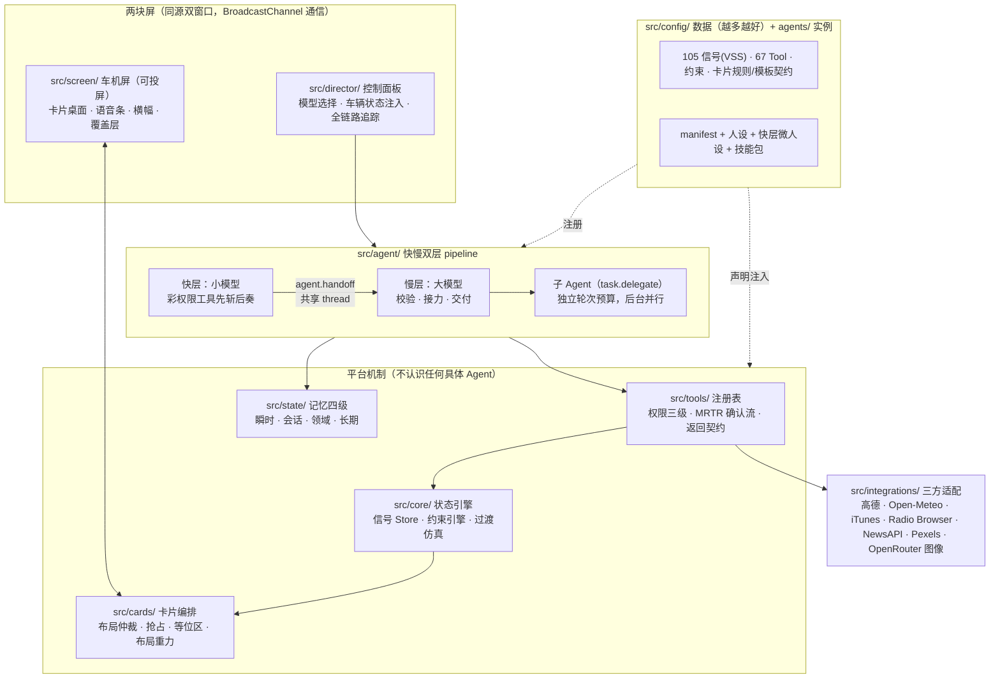

# cockpit-agent-sim

**给座舱产品经理的 AI Agent 模拟环境** —— 零后端、零运行时依赖的智能座舱 Demo 公共底座。
An agent-centric smart-cockpit simulation sandbox. Zero backend, zero runtime deps.

目标不是做一个产品,是让每次做座舱 AI Demo 不用从零开始:真实 LLM 驱动、真实第三方 API(导航/天气/音乐/新闻),车机屏可直接投屏演示。


| 后台子 Agent 调研 + 生成式计算器卡 | 调研交付:生成式报告卡(canvas) |
|---|---|
|  |  |


## 快速开始

```bash
npm install
cp .env.local.example .env.local   # 填入你自己的 Key（见文件内注释）
npm run dev                        # → http://localhost:5173
```

打开控制面板 → 选模型(慢层 + 快层)→「打开车机屏」→ 对话框里说话或打字。
试试:「今天天气怎么样」「导航去春熙路」「放首歌」「给我做个计算器」「给孩子讲个故事」。

最低只需一个 [OpenRouter](https://openrouter.ai) Key 即可对话与车控;导航/地图要高德 Key,天气(Open-Meteo)、音乐(iTunes)、电台(Radio Browser)零 Key。

```bash
npm test               # 1142 个测试，全绿才算完成
npx tsc --noEmit       # 类型检查
npm run pilot [场景id] # 自动化体验闭环（消耗真实 API 额度，不进 npm test）
node build-single.mjs  # 单文件版 → single/（双击可开；注意读不到 .env，Key 相关能力不可用）
```

## 系统架构

四条硬约束框定一切设计:**零后端**(产物是静态文件)· **加能力 = 加数据,不加代码**(新信号/Tool 只改 `src/config/`)· **代码里不许有意图分支**(出现 `if (intent === ...)` 即违规,Agent 表现不好改 Prompt 不改代码)· **运行时依赖为零**(仅 vite / vitest / typescript 三个 devDependency)。



### Agent 的组成部分

**快慢双层(过滤器架构)。** 快层小模型只挂标了 `fast: true` 的彩权限工具(约 16 个,schema 仅 2k token),车控/查询这类简单指令由它亚秒先答、先斩后奏;**无论做没做一律 `agent.handoff` 转交**慢层——两层共享同一 thread,慢层对着调用记录校验、接力剩下的活、没有新增就沉默(回空是合法答案)。整轮越权(NOT_AUTHORIZED)时快层立即收手,被拒的工具名直接预载给慢层。

**工具粒度装载,无"域"概念。** 慢层常驻的是工具目录(每 Tool 一行 brief,0.8k token)+ 常驻管道(voice/card/memory),要用什么调 `tools.load` 点名取。五个元工具(handoff / load / skill.use / task.delegate / task.cancel)由 pipeline 注入,不占业务工具表。

**子 Agent 委托。** 联网查证、成文交付这类耗时重活走 `task.delegate`:拆分决策归慢层模型,一轮连发即并行;background 模式立即返回,完成后机械交付(卡片 + 播报 + 横幅),不叫醒主模型。边界:深度 1、并发 ≤3、子 Agent 无灰权限无语音。

**Skill(章法)。** Tool 是能力,Skill 是章法,人设是品格,记忆是事实——四不相混。技能包放 `agents/main-agent/skills/`(导航、媒体、调研报告、儿童绘本),目录行常驻,`skill.use` 取正文照章执行。

**barge-in 与作废语义。** 每个 turn 带世代戳。用户**追加**一句(stale):旧层活照干完、只是不抢麦,迟到话术降级进横幅;用户**清空会话**(discarded):副作用一起作废。两种作废处置相反,不区分就会出现"重置后幽灵对话复活"。

**记忆四级。** 瞬时(信号 Store,对齐 VSS)→ 会话(域仓结论 + 对话滑窗摘要,小模型异步压缩)→ 领域(播放队列/历史/收藏,localStorage)→ 长期(显式偏好,`memory.remember` 记入,system 注入 ≤10 条)。偏好的自动学习明确不做——显式记忆是数据,自动学习是策略,策略不进代码。

**权限黑/灰/彩。** 彩 = 直接执行;灰 = 二次确认(MRTR 流,判据:不可逆/安全/金钱/涉他人);黑 = 永不注册给 Agent(刹车、转向——工具根本不存在,而非存在但被拒)。

### 卡片编排(模型零参与的那一半)

桌面 = f(车辆状态):基础卡(导航、车控回执)由声明式规则驱动,编排器调和,**模型零参与**;Agent 只为临场内容建卡(候选列表、生成式小组件),走同一布局仲裁。12×8 栅格、14 种形状、每形状一种几何;抢占按 `urgency × kind` 权重,放不下进等位区排队而非消失,空位自动上台;布局重力让卡片只往左上流、结果确定。三条显示通道各司其职:**卡片**(内容)· **横幅**(拒绝原因/回执——对动作的解释不是内容)· **覆盖层**(critical 告警)。`canvas` 模板让模型直出 HTML/SVG 进 Shadow DOM 沙箱——消毒白名单、像素容量契约、升档/缩放/滚动/文字兜底六道闸把不可预测性框住。

### 工程纪律

- **TDD 先红后绿**,1142 个测试全绿才算完成;每个目录有行数预算,超了先查是不是逻辑漏进了不该在的层
- **Tools = 机制,Agent = 策略**:Tool 内不写贴心逻辑,`climate.set` 绝不因为外面冷就自己多加两度
- **不发明命名**:信号对齐 COVESA VSS v6.0,元数据对齐 AAOS 三元组,确认流对齐 MCP MRTR
- **pilot 自动化体验闭环**:独立 LLM 扮"坐在车里的真人"跟真实 Agent 跑多轮对话,落盘快照,按四维清单人工评审

架构细节、预算纪律、实拍踩坑记录见 [CLAUDE.md](CLAUDE.md)(它同时是 AI 协作的工作手册),设计文档见 [docs/](docs/)。

## Key 与第三方服务

| 服务 | 用途 | Key | 条款须知 |
|---|---|---|---|
| OpenRouter | 对话 + 绘本插图 | 必填 | 图像 $0.07/张左右,面板有花费显示 |
| 高德开放平台 | 导航、地名解析、活地图 | 可选,两个 Key | 控制台需把 `localhost` 加入域名白名单 |
| Open-Meteo | 天气(逐时/多日) | **零 Key** | 数据 CC BY 4.0,对外材料请注明 *weather data by [Open-Meteo](https://open-meteo.com)* |
| iTunes Search | 音乐(30 秒试听) | 零 Key | 仅试听片段,无完整播放 |
| Radio Browser | 网络电台 | 零 Key | 社区节点,可用性有波动 |
| NewsAPI | 新闻 | 可选 | ⚠ 免费层**仅限 localhost,禁止部署** |
| Pexels | 短视频 | 可选 | — |

所有 Key 都写在本地 `.env.local`(已 gitignore)或控制面板里,**零后端,不经过任何中间服务器**。

## 隐私须知(绘本功能)

「路上的故事」会把**儿童照片发给第三方图像模型**(OpenRouter)用于生成动漫形象。项目本身不存储任何照片(没有后端;`public/hero/` 已整体 gitignore),但部署/演示给他人前请确认监护人知情同意——界面里的授权勾选是一次性明确动作,不是默认开关。

## 明确不做

后端 · 数据库 · 多屏 · 日夜切换 · CAN 报文级仿真 · 偏好自动学习(显式记忆是数据,自动学习是策略)。完整清单见 CLAUDE.md。

## License

[MIT](LICENSE)。第三方服务各有条款,见上表。
